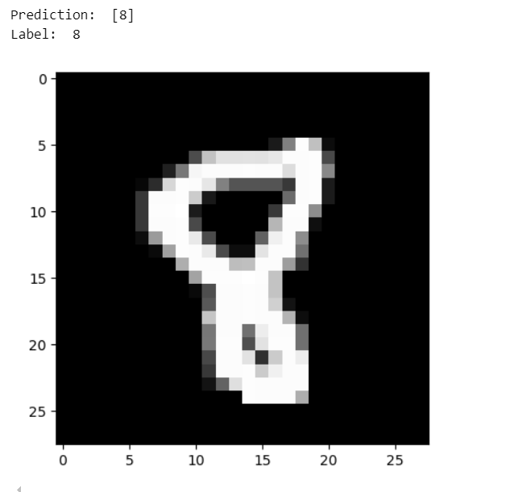
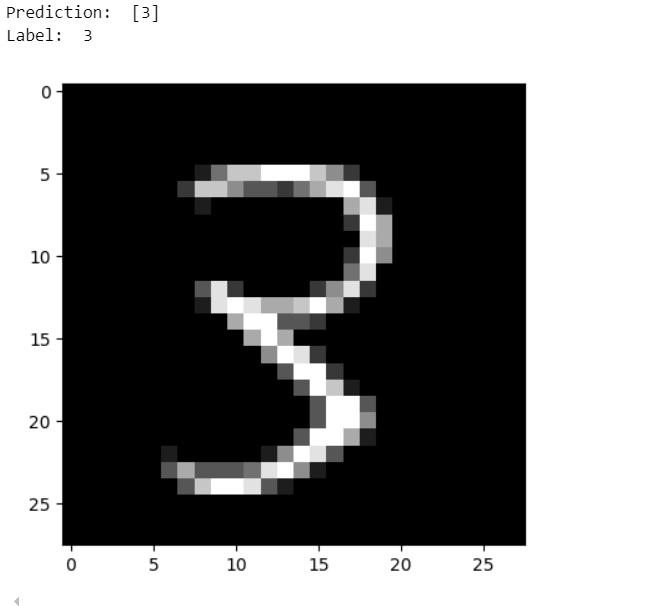

# Neural-Network-from-Scratch
**Creating a Neural Network to Recognise Handwritten Digits**

Hello, This is Vansh Dugar and I am creating this repository to help out students like me 
working on neural networks.

This Repository has an implementation of neural networks from scratch without using tensorflow or any other inbuilt libraries for neural networks, we are going to use simple libraries such as pandas,numpy and matplotlib only for reading csv files, making matrix arrays of pixels and visualising the data. 

I was curiuos about how neural networks actually work and thus wanted to implement this.

Here, i even defined the activation functions on my own and i want to keep it as simple as possible for everyone to understand.

I referred youtube majorly for this project,
## This video helped me understand the logic behind this Network and How the Flow-Of-Execution really is ##

## This Video gave me motivation to work on this project ##
 

## This Video helped me with real mathematics and implementations ##

Although there were some issues here and there i got help from AI tools such as ChatGPT to help me here and there.

Overall, this is what i have done and obtained results are as follows:

